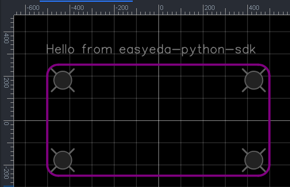

# easyeda-python-sdk
Python tools &amp; design framework for EasyEDA

## Install 

```shell
pip install easyeda-python-sdk
```

## Example

```python
from easyeda import PCB, Point

pcb = PCB()
pcb.BOARD_OUTLINE_LAYER.add_rectangle(width=1000, height=500, corner_radius=50)

pcb.DOCUMENT_LAYER.add_text("Hello from easyeda-python-sdk",
                            font_size=40, font_width=4, position=Point(-500, 300))

for p in [Point(-430, 180), Point(430, 180), Point(-430, -180), Point(430, -180)]:
    pcb.add_hole(80, center=p)

print(pcb)
```



